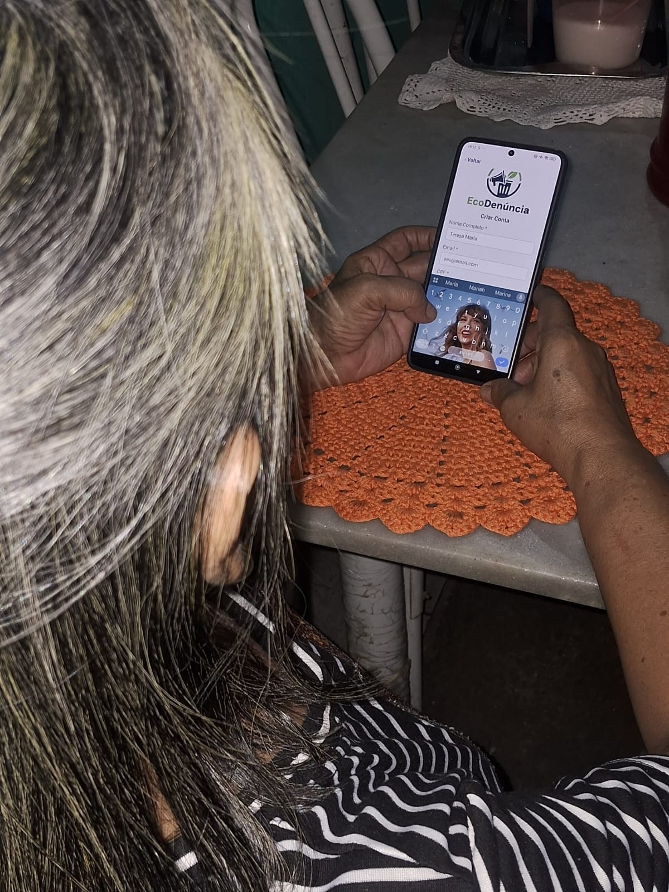
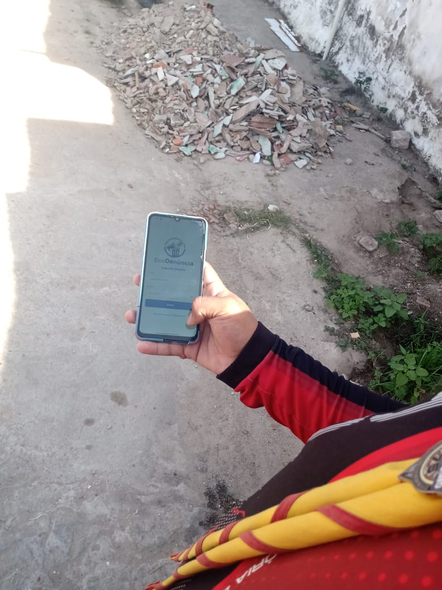
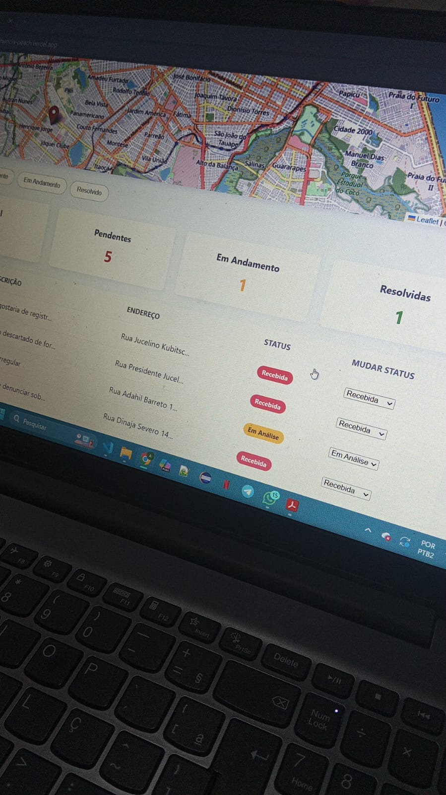

# Evidências de Validação com Usuários

Esta pasta contém registros fotográficos e anotações dos testes de usabilidade realizados com o público alvo do aplicativo **Eco Denúncia**.

**Data da Validação:** [Insira a Data, ex: 23/11/2025]
**Local:** [Ex: Igreja Adventista no Bairro Siqueira]

---

## Teste 1: Fluxo de Cadastro
**Participante:** [Teresa Maria, ~62 anos]
**Contexto:** O usuário foi convidado a criar uma conta.

*(Legenda: Usuário criando conta)*

**Observações:**
- O usuário conseguiu criar sua conta sem dificuldades.

---

## Teste 2: Fluxo de Cadastro
**Participante:** [Iranildo Rodrigues, Estudante, ~22 anos]
**Contexto:** O usuário foi conviado a fazer uma denúncia

*(Legenda: Usuário denunciando)*

**Observações:**
- O usuário conseguiu criar a denúncia sem dificuldades.

## Teste 3: Tela de Dashboard
**Participante:** [Lucas Matheus, Diretor, ~27 anos]
**Contexto:** O usuário acessando o dasboard de denúncias

*(Legenda: Tela de denúncias do Dashboard)*

## Evidencia: Público Alvo
**Participante:** [Desbravadores ]
**Contexto:** Os usuários felizes com o app

*(Legenda: Público Alvo gritando o nome do App)*

## Demonstração: Tela do mobile
**Participante:** [Thayná Stephanie  ]

*(Legenda: Integrante do grupo Thayná Stephanie, desmonstrando o uso do app)*

## Demonstração: Tela do Dashboard
**Participante:** [Thayná Stephanie  ]

*(Legenda: Integrante do grupo Thayná Stephanie, desmonstrando o uso do Dashboard)*

---